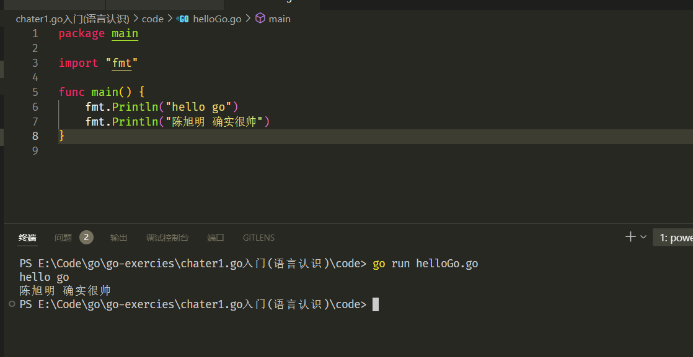
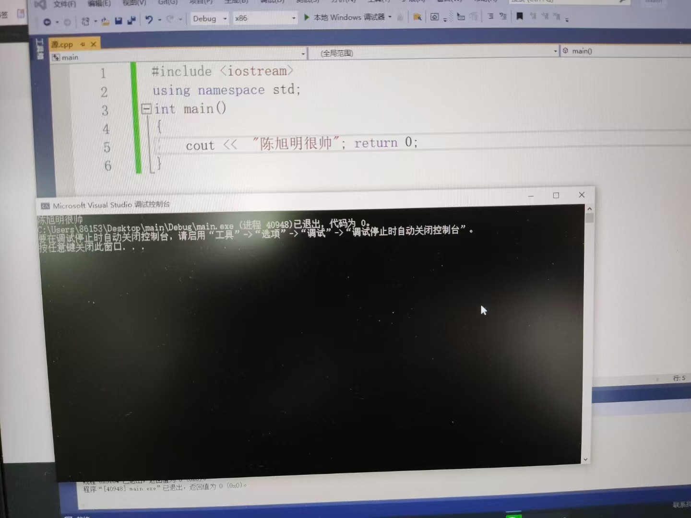

# 经典第一个程序
通过该次总结： 达成如下效果。
1. Hello圣经，过一个仪式感。
2. 简单程序的执行流程（可以打力扣的入门水平）

## go 环境安装
总的来说分为几个步骤：
1. 资源准备：（安装包-go 开发工具集合）
2. 配置环境变量，让系统知道 go 相关工具的位置，简化平时go 开发工具的使用。
3. 依赖管理框架下的一些配置。
// TODO 需要尝试解答对这些东西的认识。
GOPATH: 
GOROOT:

##  第一个Go 代码

上述是第一个 c++ 程序？ maybe。

恍惚的三年就过去了。 确实学到了很多东西~

---

### 运行

该技术的背景：

go 作为一个go语言的一个工具集合。run 的过程中使用了编译器，对这份源代码编译成了二进制位文件。在构建之后，执行该可执行文件。在这之后，同时将该可执行文件清空。

该背景涉及了软件开发的一个更原理层，追踪为一个问题就是：一个高级语言，最终如何翻译成机器指令，做到语法层与机器层的一致。

### 基本结构剖析

**package**: 包 是go 语言中组织代码的基本单元。该类型的意义是，代码的模块化和复用代码。
几个重要的常识如下：

1. `main` 包是特殊的包，包含程序的入口函数 `main()`，只有 `main` 包能被直接运行。
2. 每个.go 文件必须 归属于一个包。
3. 同一个目录下的所有.go 文件必须归属于同一个包。

**fmt** : fmt 包作为 go 标准库中的一个重要的包：负责格式化输入、输出。一些作为标准的包，总是作为软件开发中的常见话题。其中包括了，类似于 fmt 的格式化输入输出。os -> 与操作系统交互（命令行工具）负责了网络web 服务的一些常用的包等。

**import** : 为一些重要功能，定义的语法规则（关键字）import 关键字描述了导包的语法。

### 一些吐槽

1. 为什么Println 函数名是大写开头的。
2. 不需要分号，确实舒服。
3. 为啥需要一个func 关键字定义函数。。可能是一种创新吧~
